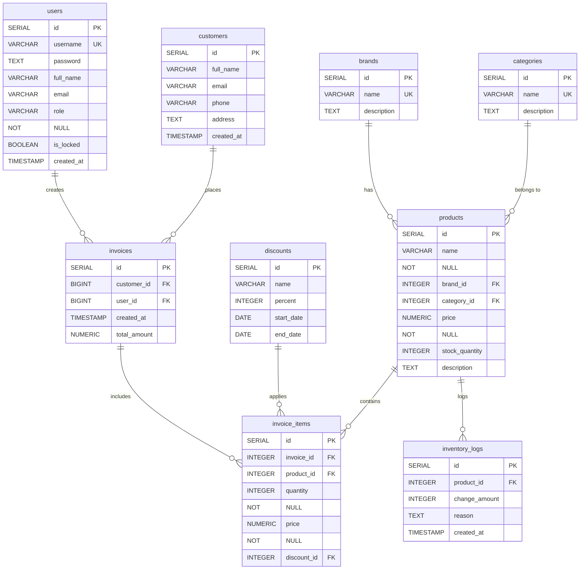

# Sơ đồ Quan hệ Thực thể (ERD) và Phân tích Cơ sở dữ liệu

Phần này cung cấp cái nhìn tổng quan về cấu trúc cơ sở dữ liệu của ứng dụng Quản lý Cửa hàng Xe, bao gồm sơ đồ quan hệ thực thể (ERD) và phân tích chi tiết các bảng.

## Sơ đồ Quan hệ Thực thể (ERD)

## Phân tích các bảng

### 1. `users`
*   **Mục đích**: Lưu trữ thông tin người dùng hệ thống, bao gồm nhân viên và quản trị viên.
*   **Các cột chính**: `id` (khóa chính), `username` (duy nhất), `password` (đã mã hóa), `full_name`, `email`, `role` (phân quyền: ADMIN, MANAGER, STAFF), `is_locked` (trạng thái tài khoản).
*   **Quan hệ**: Liên kết với `invoices` qua `user_id` (người tạo hóa đơn).

### 2. `customers`
*   **Mục đích**: Lưu trữ thông tin khách hàng.
*   **Các cột chính**: `id` (khóa chính), `full_name`, `email`, `phone`, `address`.
*   **Quan hệ**: Liên kết với `invoices` qua `customer_id` (khách hàng của hóa đơn).

### 3. `brands`
*   **Mục đích**: Lưu trữ thông tin các thương hiệu xe.
*   **Các cột chính**: `id` (khóa chính), `name` (duy nhất), `description`.
*   **Quan hệ**: Liên kết với `products` qua `brand_id`.

### 4. `categories`
*   **Mục đích**: Lưu trữ thông tin các danh mục sản phẩm (ví dụ: xe máy, xe đạp, phụ tùng).
*   **Các cột chính**: `id` (khóa chính), `name` (duy nhất), `description`.
*   **Quan hệ**: Liên kết với `products` qua `category_id`.

### 5. `products`
*   **Mục đích**: Lưu trữ thông tin chi tiết về các sản phẩm xe.
*   **Các cột chính**: `id` (khóa chính), `name`, `brand_id`, `category_id`, `price`, `stock_quantity`, `description`.
*   **Quan hệ**: Liên kết với `invoice_items` và `inventory_logs`.

### 6. `discounts- đang phát triển`
*   **Mục đích**: Lưu trữ thông tin các chương trình giảm giá.
*   **Các cột chính**: `id` (khóa chính), `name`, `percent`, `start_date`, `end_date`.
*   **Quan hệ**: Liên kết với `invoice_items` qua `discount_id`.

### 7. `invoices`
*   **Mục đích**: Lưu trữ thông tin các hóa đơn bán hàng.
*   **Các cột chính**: `id` (khóa chính), `customer_id`, `user_id`, `created_at`, `total_amount`.
*   **Quan hệ**: Liên kết với `customers` và `users`, và là khóa ngoại cho `invoice_items`.

### 8. `invoice_items`
*   **Mục đích**: Lưu trữ chi tiết các sản phẩm trong mỗi hóa đơn.
*   **Các cột chính**: `id` (khóa chính), `invoice_id`, `product_id`, `quantity`, `price` (giá tại thời điểm bán), `discount_id`.
*   **Quan hệ**: Liên kết với `invoices`, `products` và `discounts`.

### 9. `inventory_logs`
*   **Mục đích**: Ghi lại lịch sử thay đổi số lượng tồn kho của sản phẩm.
*   **Các cột chính**: `id` (khóa chính), `product_id`, `change_amount`, `reason`, `created_at`.
*   **Quan hệ**: Liên kết với `products`.
